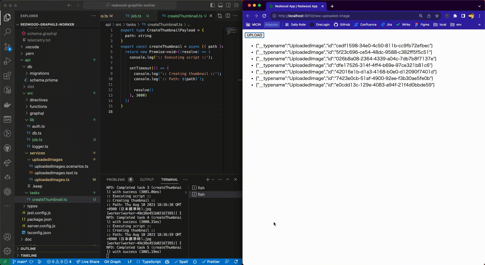

# PoC Async Job with Graphile Worker on Redwood.js

## What is this?
This is an PoC project to set up async job with [Graphile Worker](https://github.com/graphile/worker)

https://community.redwoodjs.com/t/how-do-i-run-background-or-cron-jobs/2971/11


## How to run
### 1. Start PostgreSQL
```bash
docker-compose up -d
```

### 2. Install dependencies
```bash
yarn install
```

### 3. Run migration
```bash
yarn rw prisma migrate dev
```

### 4. Start Async Job Worker
```bash
yarn rw exec asyncJobWorker
```

### 5. Start Redwood.js
```bash
yarn rw dev
```

### 6. Open http://localhost:8910/new-uploaded-image

### 7. Check the log of Async Job Worker



## Why Graphile Worker?
The reason I chose Graphile Worker as a async job worker is that it is independent from Redis or MongoDB like other node.js async job workers.
I think it is good to use PostgreSQL as a single source of truth for the application because in most cases I use PostgreSQL as a database.

## DB Schema
[DB Schema Generated by tbls](doc/db/README.md)
