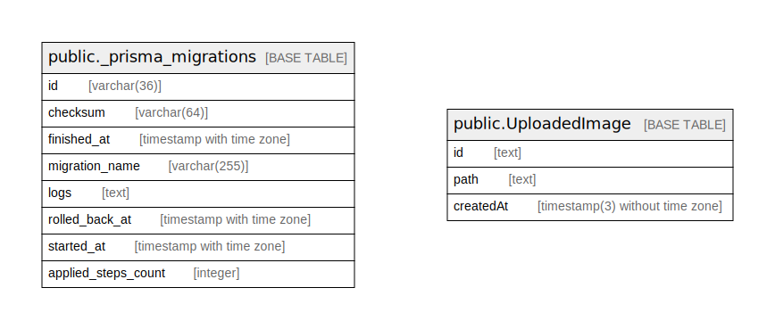

# app

## テーブル一覧

| 名前 | カラム一覧 | コメント | タイプ |
| ---- | ------- | ------- | ---- |
| [public._prisma_migrations](public._prisma_migrations.md) | 8 |  | BASE TABLE |
| [public.UploadedImage](public.UploadedImage.md) | 3 |  | BASE TABLE |
| [graphile_worker.migrations](graphile_worker.migrations.md) | 2 |  | BASE TABLE |
| [graphile_worker.job_queues](graphile_worker.job_queues.md) | 4 |  | BASE TABLE |
| [graphile_worker.jobs](graphile_worker.jobs.md) | 16 |  | BASE TABLE |
| [graphile_worker.known_crontabs](graphile_worker.known_crontabs.md) | 3 |  | BASE TABLE |

## Stored procedures and functions

| 名前 | ReturnType | Arguments | タイプ |
| ---- | ------- | ------- | ---- |
| graphile_worker.tg__update_timestamp | trigger |  | FUNCTION |
| graphile_worker.jobs__decrease_job_queue_count | trigger |  | FUNCTION |
| graphile_worker.jobs__increase_job_queue_count | trigger |  | FUNCTION |
| graphile_worker.tg_jobs__notify_new_jobs | trigger |  | FUNCTION |
| graphile_worker.complete_job | jobs | worker_id text, job_id bigint | FUNCTION |
| graphile_worker.fail_job | jobs | worker_id text, job_id bigint, error_message text | FUNCTION |
| graphile_worker.add_job | jobs | identifier text, payload json DEFAULT NULL::json, queue_name text DEFAULT NULL::text, run_at timestamp with time zone DEFAULT NULL::timestamp with time zone, max_attempts integer DEFAULT NULL::integer, job_key text DEFAULT NULL::text, priority integer DEFAULT NULL::integer, flags text[] DEFAULT NULL::text[], job_key_mode text DEFAULT 'replace'::text | FUNCTION |
| graphile_worker.remove_job | jobs | job_key text | FUNCTION |
| graphile_worker.get_job | jobs | worker_id text, task_identifiers text[] DEFAULT NULL::text[], job_expiry interval DEFAULT '04:00:00'::interval, forbidden_flags text[] DEFAULT NULL::text[], now timestamp with time zone DEFAULT now() | FUNCTION |
| graphile_worker.complete_jobs | jobs | job_ids bigint[] | FUNCTION |
| graphile_worker.permanently_fail_jobs | jobs | job_ids bigint[], error_message text DEFAULT NULL::text | FUNCTION |
| graphile_worker.reschedule_jobs | jobs | job_ids bigint[], run_at timestamp with time zone DEFAULT NULL::timestamp with time zone, priority integer DEFAULT NULL::integer, attempts integer DEFAULT NULL::integer, max_attempts integer DEFAULT NULL::integer | FUNCTION |

## ER図

---

> Generated by [tbls](https://github.com/k1LoW/tbls)
