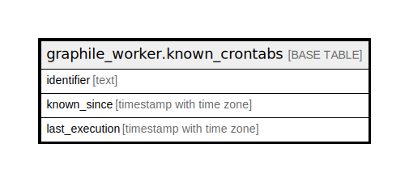

# graphile_worker.known_crontabs

## 概要

## カラム一覧

| 名前 | タイプ | デフォルト値 | Nullable | 子テーブル | 親テーブル | コメント |
| ---- | ------ | ------------ | -------- | ---------- | ---------- | -------- |
| identifier | text |  | false |  |  |  |
| known_since | timestamp with time zone |  | false |  |  |  |
| last_execution | timestamp with time zone |  | true |  |  |  |

## 制約一覧

| 名前 | タイプ | 定義 |
| ---- | ---- | ---------- |
| known_crontabs_pkey | PRIMARY KEY | PRIMARY KEY (identifier) |

## INDEX一覧

| 名前 | 定義 |
| ---- | ---------- |
| known_crontabs_pkey | CREATE UNIQUE INDEX known_crontabs_pkey ON graphile_worker.known_crontabs USING btree (identifier) |

## ER図

---

> Generated by [tbls](https://github.com/k1LoW/tbls)
