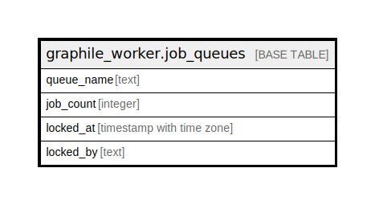

# graphile_worker.job_queues

## 概要

## カラム一覧

| 名前 | タイプ | デフォルト値 | Nullable | 子テーブル | 親テーブル | コメント |
| ---- | ------ | ------------ | -------- | ---------- | ---------- | -------- |
| queue_name | text |  | false |  |  |  |
| job_count | integer |  | false |  |  |  |
| locked_at | timestamp with time zone |  | true |  |  |  |
| locked_by | text |  | true |  |  |  |

## 制約一覧

| 名前 | タイプ | 定義 |
| ---- | ---- | ---------- |
| job_queues_pkey | PRIMARY KEY | PRIMARY KEY (queue_name) |

## INDEX一覧

| 名前 | 定義 |
| ---- | ---------- |
| job_queues_pkey | CREATE UNIQUE INDEX job_queues_pkey ON graphile_worker.job_queues USING btree (queue_name) |

## ER図

---

> Generated by [tbls](https://github.com/k1LoW/tbls)
