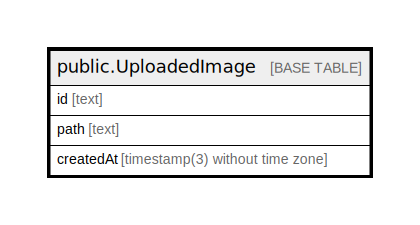

# public.UploadedImage

## 概要

Image uploaded to S3

## カラム一覧

| 名前 | タイプ | デフォルト値 | Nullable | 子テーブル | 親テーブル | コメント |
| ---- | ------ | ------------ | -------- | ---------- | ---------- | -------- |
| id | text |  | false |  |  |  |
| path | text |  | false |  |  | S3 path to image |
| createdAt | timestamp(3) without time zone | CURRENT_TIMESTAMP | false |  |  |  |

## 制約一覧

| 名前 | タイプ | 定義 |
| ---- | ---- | ---------- |
| UploadedImage_pkey | PRIMARY KEY | PRIMARY KEY (id) |

## INDEX一覧

| 名前 | 定義 |
| ---- | ---------- |
| UploadedImage_pkey | CREATE UNIQUE INDEX "UploadedImage_pkey" ON public."UploadedImage" USING btree (id) |
| UploadedImage_path_key | CREATE UNIQUE INDEX "UploadedImage_path_key" ON public."UploadedImage" USING btree (path) |

## ER図

---

> Generated by [tbls](https://github.com/k1LoW/tbls)
